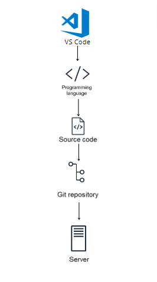
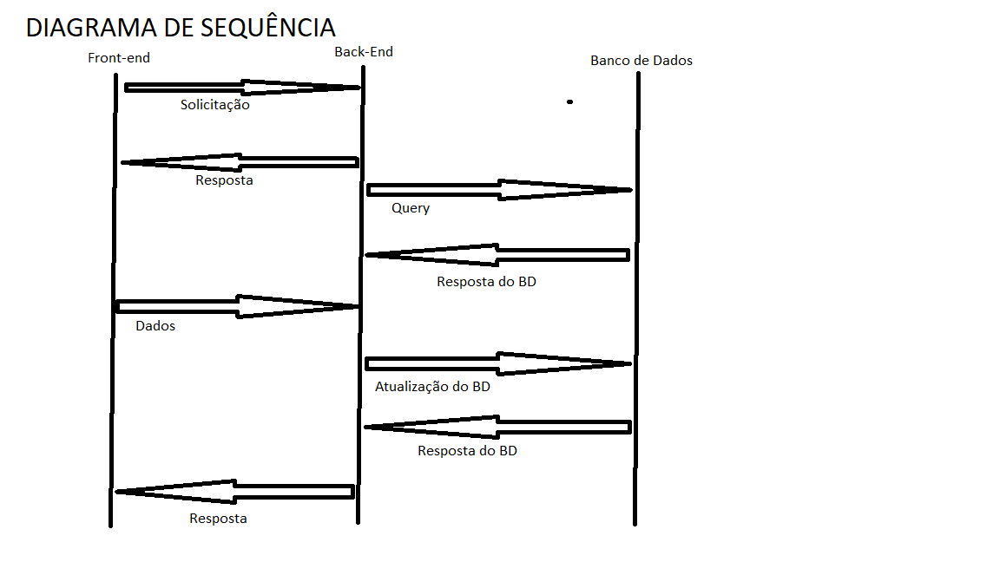

# My Music Collection

Welcome to My Music Collection! This web application allows users to manage and organize their favorite music collection effortlessly. Whether you want to add new songs, edit existing ones, or remove them, this application has got you covered. Additionally, it offers a unique feature to track changes in the database and extract modified data to a file for further analysis.

 

## Table of Contents
- [Features](#features)
- [Technologies Used](#technologies-used)
- [Getting Started](#getting-started)
- [Usage](#usage)
- [Diagrams](#diagrams)
  - [Solution Design](#solution-design)
  - [Sequence Diagram](#sequence-diagram)

## Features
- **CRUD Operations:** Users can perform Create, Read, Update, and Delete operations on their music collection.
- **Change Tracking:** Automatically detects changes in the database and extracts modified data to a file.
- **User-Friendly Interface:** Intuitive and easy-to-use interface for seamless navigation and interaction.

## Technologies Used
- Angular 17+
- Java 22+
- Maven 3.9.6
- AWS (Amazon Web Services)
- Relational Database (MySQL)
- 

## Getting Started
To get started with the application, follow these steps:

1. Clone the repository: `git clone https://github.com/your-repository-url.git`
2. Navigate to the frontend directory: `cd frontend`
3. Install dependencies: `npm install`
4. Run the application: `ng serve`

## Usage
Once the application is up and running, you can access it through your web browser. Here are some steps to utilize its functionalities:

1. **Login/Register:** If it's your first time, register as a new user. Otherwise, log in with your credentials.
2. **Add New Song:** Click on the "Add Song" button to insert a new song into your collection.
3. **Edit Song:** Select a song from your collection and click on the "Edit" button to modify its details.
4. **Delete Song:** Remove any unwanted songs from your collection by clicking on the "Delete" button.
5. **Track Changes:** The application automatically monitors database changes. You can view the extracted data in the designated file for analysis.

## Diagrams

### Solution Design

### Sequence Diagram 

For more details, refer to the respective diagram images provided in the repository.

Enjoy managing your music collection hassle-free with My Music Collection! If you have any questions or feedback, feel free to reach out.

---
*This application was developed as part of a challenge.*
